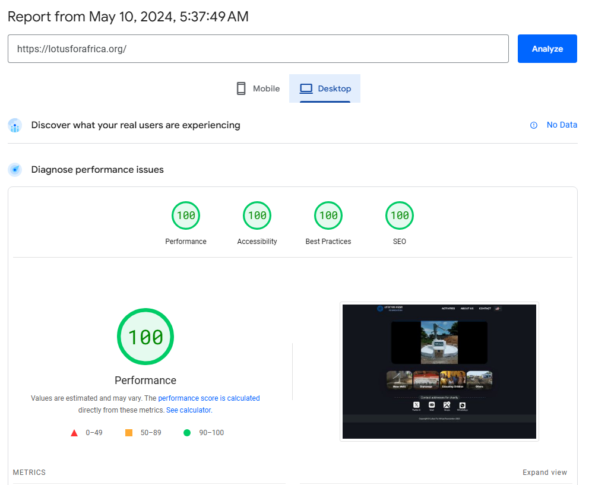

# lotusforafrica

Website source code for [lotusforafrica.org](https://lotusforafrica.org/).

Built with **Astro**, **React**, and **Bun**.

---

## 🚀 Quick Start

### Prerequisites
- [Bun](https://bun.sh/) (v1.0+)

### Setup & Development

```bash
# Install dependencies
bun install

# Start development server
bun dev

# Build for production
bun run build

# Preview production build
bun run preview
```

---

## 🚰 Adding New Water Wells

Image processing and CSV registry updates for new water wells are automated using Bun and Sharp.

### Usage Options

1. **Batch mode (`raw_images` folder)**:
   Place images in the `./raw_images` directory and run:
   ```bash
   bun run add-well
   ```

2. **Single file mode**:
   Pass the file path and (optionally) owner name:
   ```bash
   bun run add-well ./path/to/photo.jpg "Owner Name"
   ```

### What `add-well` does automatically:
- Generates 426px thumbnail image (`src/assets/img/wells/thumbnails/XXX-well.webp`)
- Generates 1280px full image (`src/assets/img/wells/full/XXX-well.webp`)
- Generates 1920x1080 slider image (`src/assets/img/slider/XXX-well.webp`)
- Appends well entry to `src/assets/wellOwnerNames.csv`
- Moves raw image to `raw_images/processed/`

---

## 📌 Project Notes & References

- **Multi-language support**: [astro-i18n-aut](https://github.com/jlarmstrongiv/astro-i18n-aut)
- **Slider Component**: [react-awesome-slider](https://github.com/rcaferati/react-awesome-slider)
- **Homepage design inspiration**: [StartBootstrap Freelancer](https://github.com/StartBootstrap/startbootstrap-freelancer)

---

## ⚡ Pagespeed Score

